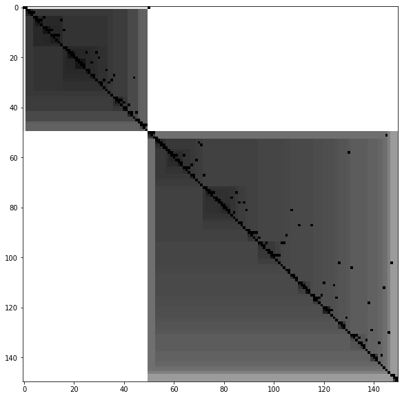

.. pyclustertend documentation master file, created by
   sphinx-quickstart on Sat Sep  7 09:15:14 2019.
   You can adapt this file completely to your liking, but it should at least
   contain the root `toctree` directive.

Welcome to pyclustertend's documentation!
=========================================

**Deployment & Documentation & Stats**

.. image:: https://img.shields.io/pypi/v/pyclustertend.svg?color=brightgreen
   :target: https://pypi.org/project/pyclustertend/
   :alt: PyPI version

.. image:: https://readthedocs.org/projects/pyclustertend/badge/?version=latest
   :target: https://pyclustertend.readthedocs.io/en/latest/?badge=latest
   :alt: Documentation Status

.. image:: https://img.shields.io/github/stars/lachhebo/pyclustertend.svg
   :target: https://github.com/lachhebo/pyclustertend/stargazers
   :alt: GitHub stars

.. image:: https://img.shields.io/github/forks/lachhebo/pyclustertend.svg?color=blue
   :target: https://github.com/lachhebo/pyclustertend/network
   :alt: GitHub forks

.. image:: https://pepy.tech/badge/pyclustertend
   :target: https://pepy.tech/project/pyclustertend
   :alt: Downloads

.. image:: https://pepy.tech/badge/pyclustertend/month
   :target: https://pepy.tech/project/pyclustertend/month
   :alt: Downloads_month

**Build Status & Coverage & Maintainability & License**

.. image:: https://travis-ci.com/lachhebo/pyclustertend.svg?branch=master
   :target: https://travis-ci.com/lachhebo/pyclustertend
   :alt: Build Status

pyclustertend is a **Python toolkit** for **assessing cluster tendency**.
Cluster tendency is about discovering the existence of clusters
in data (http://www.sthda.com/english/wiki/print.php?id=238).

Introduction
------------

When clustering is used, a workflow that can be used is to follow those steps:

- **cluster tendency assessment** : Check wether the clustering can bring something relative to the data in question.

- **apply clustering** : Use one of the many clustering algorithm to obtain a segmentation of data.

- **cluster validation** : Assess the quality of the clustering

This package have for main purpose to gather the most notable methods to do cluster
tendency assessment.

Package description of module
------------------------------

The methods currently developed in the package are :

- **Hopkins test**

A  statistical test which allow to guess if the data follow an uniform distribution.
If the test is positve, (an hopkins score which tends to 0) it means that clustering is useless for the dataset.

- **VAT**

VAT (visual assessment of tendency) is a algorithm which create a visualisation of a specific dataset, this visualisation can be useful to obtain an insight on the
number of cluster and cluster hierarchy. The algorithm create a minimum spanning tree of observations, The pairwise distance between those observations are displayed.
The more the color is black, the more the distance between two observations is small.
A way to interpert the image is to count the number of black square in the diagonal which should represent the number of cluster.

.. code-block:: python

    from sklearn import datasets
    from pyclustertend import vat
    from sklearn.preprocessing import scale
    X = scale(datasets.load_iris().data)
    vat(X)

.. image:: vat.png

For the iris dataset, we can conclude that they are 2 clusters.

.. code-block:: python

    from sklearn import datasets
    from pyclustertend import ivat
    from sklearn.preprocessing import scale
    X = scale(datasets.load_iris().data)
    ivat(X)

The ivat algorithm is a improved version of the vat algorithm which produce more precise images at the cost of a heavier computing cost

- **metric function**

Cluster validation metrics used in conjonction with the KMeans algorithm.

API
---

.. automodule:: pyclustertend.hopkins
  :members:
  :exclude-members:
  :undoc-members:
  :show-inheritance:
  :inherited-members:

.. automodule:: pyclustertend.vat
  :members:
  :exclude-members:
  :undoc-members:
  :show-inheritance:
  :inherited-members:

.. automodule:: pyclustertend.metric
  :members:
  :exclude-members:
  :undoc-members:
  :show-inheritance:
  :inherited-members:

**Key Links and Resources**\ :

* `View the latest codes on Github <https://github.com/lachhebo/pyclustertend>`_

.. toctree::
   :maxdepth: 2
   :caption: Contents:

.. toctree::
   :maxdepth: 2
   :hidden:
   :caption: Documentation

   pyclustertend
